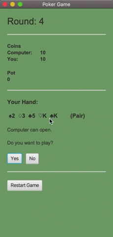

# PokerGame
JavaFX Poker Game - Small College Project
April 2020

(Built in Eclipse using Maven)

## Classes
1. Main (driver class - creates a deck of cards and 2 players, allows players to play, check, bet, etc.)
2. Player (draws cards from the deck and evaluates the hands, also keeps track of players coin balance)
3. Deck (creates an ArrayList of 52 Card objects)
4. Card (stores the value and suit of a single playing card)

